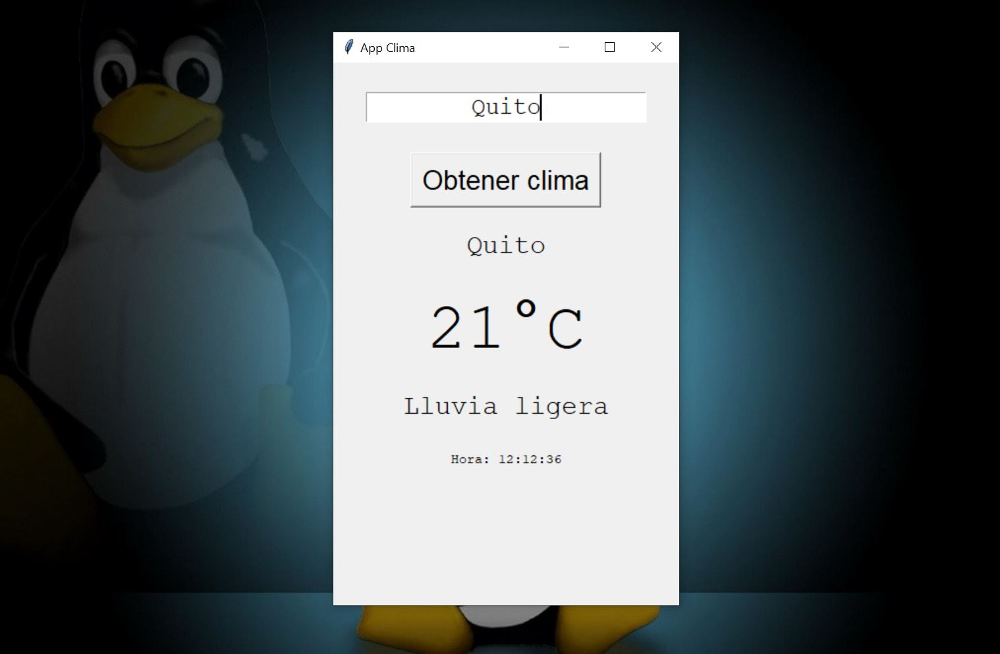

# Tkinter_Simple_App_Clima
En esta aplicacion con interfaz grafica realizada con tkinter utilizamos la API de https://openweathermap.org/ para mostrar la temperatura y una descripcion de clima la ciudad y la hora
[+]No olvides instalar la libreria requests en python3 para las peticiones

